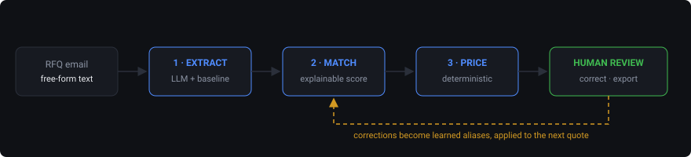

# RFQ Copilot

Turns a messy request-for-quote email into a draft quote a salesperson can
review line by line, correct, and export — and learns from every correction.

Industrial distributors receive RFQs as free-form email. Someone in inside
sales reads each one, figures out which SKU the buyer meant, checks stock,
applies the customer's discount tier, and types it all into an ERP. It takes
20–40 minutes per quote and it is the same work every time.

This is a working end-to-end slice of that: extraction, product matching,
pricing, a review UI, and an evaluation harness.



---

## What it does

```
messy RFQ text
      │
      ▼
┌─────────────┐   LLM extraction, with a deterministic
│  1 EXTRACT  │   heuristic baseline as fallback
└─────────────┘
      │  line items: description, qty, size, material
      ▼
┌─────────────┐   attribute-aware scoring against a 70-SKU catalog,
│  2 MATCH    │   plus aliases learned from past human corrections
└─────────────┘
      │  candidate SKUs with a confidence and a reason
      ▼
┌─────────────┐   tier + volume discount, stock check,
│  3 PRICE    │   lead time. Plain Python, no model.
└─────────────┘
      │
      ▼
draft quote  →  human reviews  →  corrections feed back into matching
```

**The part that matters is the last arrow.** A salesperson fixing a line is the
highest-quality training signal the system will ever get: a domain expert
telling you that *this wording* means *this part*. Those corrections are stored
and applied to the next quote, so a one-off fix becomes a permanent capability.

## Design decisions worth arguing about

**Pricing is not an LLM call.** Anything a customer could dispute on an invoice
has to be deterministic and diffable. The model reads the email; it does not
decide what anyone pays.

**There is a dumb baseline on purpose.** `heuristic_extract` is regex and line
splitting. It needs no API key and no network. It exists so the app runs for
anyone who clones the repo, so the evals run in CI, and — mainly — so there is
something to measure the LLM against. "The AI works" is not a claim you can act
on. "The LLM adds X points of SKU accuracy over regex on these ten cases" is,
and the harness below is what produces that number.

**Confidence is a first-class output, not a nice-to-have.** A system that is
right 90% of the time and cannot tell you *which* 90% is unusable in front of a
customer. Every line carries a confidence, a `needs_review` flag, and a
human-readable reason. The review metric in the eval suite scores exactly this.

**Matching is explainable, not embedding-based.** Every candidate says why it
scored what it scored: *"size 1/2\" matches, material mismatch: wanted SS316,
SKU is CS"*. The person reviewing is a salesperson. "Trust the cosine
similarity" is not something they can act on, and it is not something they can
correct.

**Size and material are hard constraints.** In this domain a 1/2" valve and a
2" valve are not similar products, they are different products, and text
similarity will happily confuse them. So attribute agreement adds weight and
attribute conflict subtracts more than text similarity can recover.

## Running it

Backend:

```bash
python -m venv .venv && source .venv/bin/activate
pip install -r requirements.txt
cp .env.example .env          # optional: add ANTHROPIC_API_KEY
cd backend && uvicorn app.main:app --reload
```

Frontend:

```bash
cd frontend && npm install && npm run dev
```

Open http://localhost:5173. Without an API key the app still works — it falls
back to the heuristic extractor and says so in the UI.

## Evaluation

```bash
python evals/run_eval.py              # heuristic baseline, no key needed
python evals/run_eval.py --llm        # LLM extractor
python evals/run_eval.py --llm --compare
```

Ten golden cases in `evals/cases.json`, each with a note explaining what it is
testing and why. They cover the failures that actually happen in an inbox:
metric vs imperial sizing, five different quantity formats, signature blocks
that must not become line items, requests for products that are not in the
catalog, typos, and one prose paragraph with the numbers spelled out.

Baseline result, reproducible without an API key:

```
=== heuristic baseline ===
  line count   9/10 (90%)
  sku match    9/11 (82%)
  quantity     5/7 (71%)
  review flag  2/2 (100%)
```

The single case the baseline fails completely is `prose_paragraph` — a buyer
writing in flowing sentences with "twelve" and "forty" spelled out. It finds
zero line items there.

The LLM row is not published here: `--llm --compare` needs an
`ANTHROPIC_API_KEY`, and I would rather leave it empty than fill it with a
figure I have not measured. Anyone with a key reproduces it in one command,
and `prose_paragraph` is where I expect the gap to show.

## API

| Method | Path | Purpose |
|---|---|---|
| `GET`  | `/health` | liveness, catalog size |
| `GET`  | `/catalog?q=` | search the product catalog |
| `POST` | `/quote` | RFQ text in, draft quote out |
| `POST` | `/quote/upload` | same, from a `.csv` or `.txt` file |
| `POST` | `/quote/{id}/corrections` | record human fixes, feed the learning loop |
| `GET`  | `/aliases` | learned aliases and the SKU confusion table |
| `POST` | `/quote/{id}/export` | quote as CSV |

Interactive docs at http://localhost:8000/docs.

## Layout

```
backend/app/
  models.py     pydantic shapes for every stage boundary
  catalog.py    catalog loading, text normalisation, size/material parsing
  extract.py    stage 1 — LLM extraction + heuristic fallback
  match.py      stage 2 — explainable scoring against the catalog
  aliases.py    the learning loop (SQLite)
  pricing.py    stage 3 — discounts, stock, lead time
  main.py       FastAPI surface
evals/
  cases.json    golden set, each case annotated with what it tests
  run_eval.py   scorecard: line count, SKU, quantity, review calibration
frontend/src/
  App.jsx       review UI — inline SKU override, per-line reasoning, export
data/
  catalog.csv   70 SKUs: valves, fittings, bearings, hose, fasteners, gaskets
```

## What is deliberately missing

Honest list, because a demo that pretends to be a product is worse than one
that knows what it is:

- **No auth, no tenancy.** Quotes live in a dict. Fine for a demo, not for two
  customers.
- **Exact-match aliases only.** Normalised string equality, not semantic. It
  catches the case that actually recurs — the same buyer writing the same odd
  phrase every month — and nothing cleverer.
- **No real ERP write-back.** Export is CSV. A real deployment would push to
  the customer's order entry system, which is where most of the integration
  work would actually be.
- **Catalog is synthetic.** 70 SKUs generated to be realistically ambiguous
  (five sizes of the same valve in three materials), but synthetic.
- **Single-currency, no tax, no freight.**

## License

MIT.
